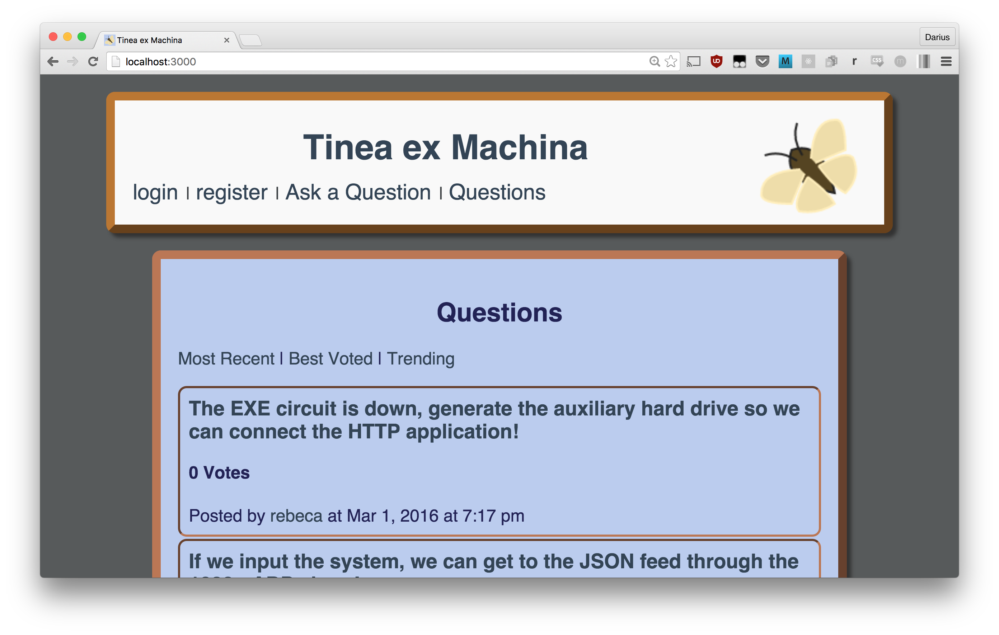

# Tinea ex Machina

## Team Moth
Darius Atmar, Carolina Medellin, Bernadette Maschiocchi, Peter Wood

Tinea ex Machina is a Stack Overflow clone and our first Rails web application.

## Built With
Tinea ex Machina is built with the following open source components:
- [Ruby on Rails](https://github.com/rails/rails)
- [PostgreSQL](http://www.postgresql.org/)
- [jQuery](http://jquery.com/)

###Dependencies
- [PostgreSQL](http://www.postgresql.org/)
- Bundler gem ('gem install bundler')

##How to Run Our App Locally (OS X 10.8 or later)
1. In the terminal:
~~~
git clone https://github.com/datmar/tinea-ex-machina
~~~
2. Enter the root directory and run the following commands:
~~~
bundle install
bundle exec rake db:drop && rake db:create && rake db:migrate && rake db:seed
bundle exec rails s
~~~
3. The app will now be running on localhost:
~~~
=> Booting WEBrick
=> Rails 4.2.5 application starting in development on http://localhost:3000
=> Run `rails server -h` for more startup options
=> Ctrl-C to shutdown server
~~~

###Homepage

